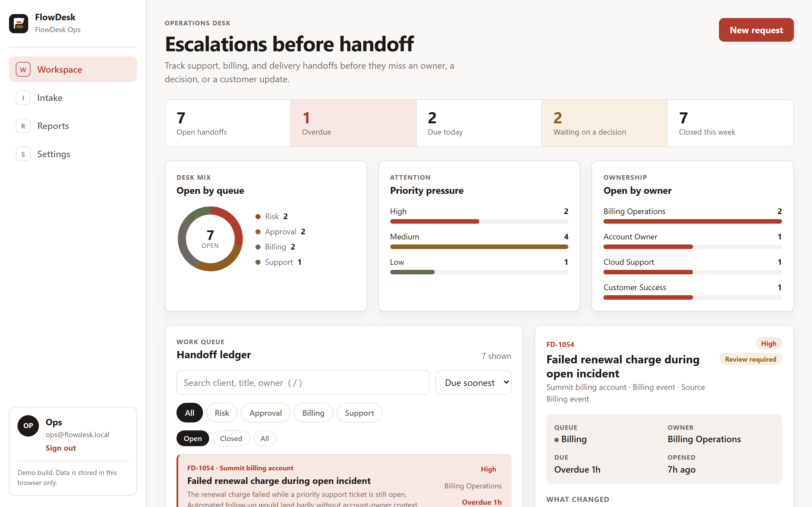
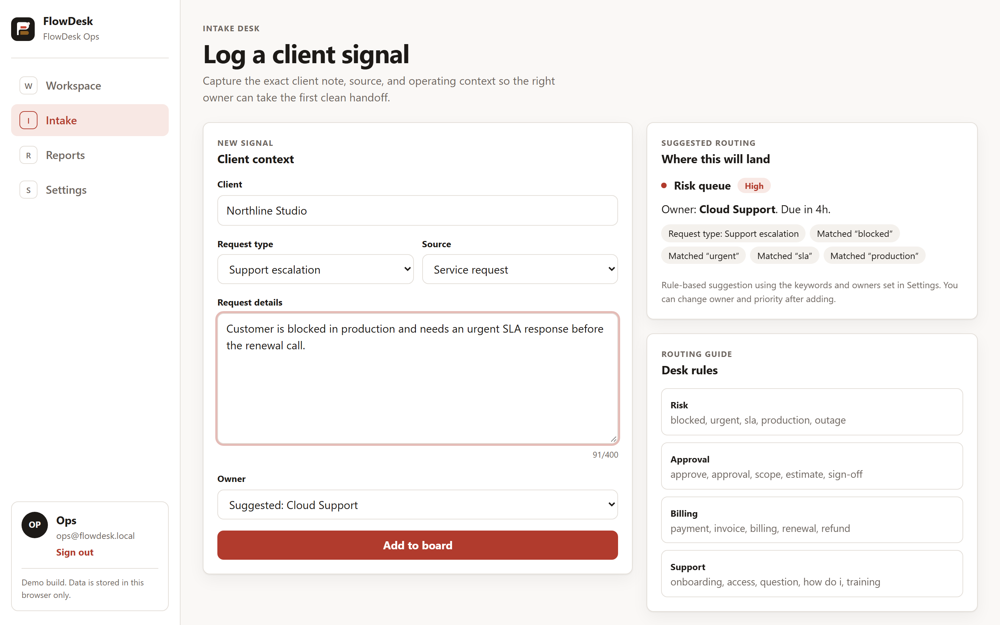
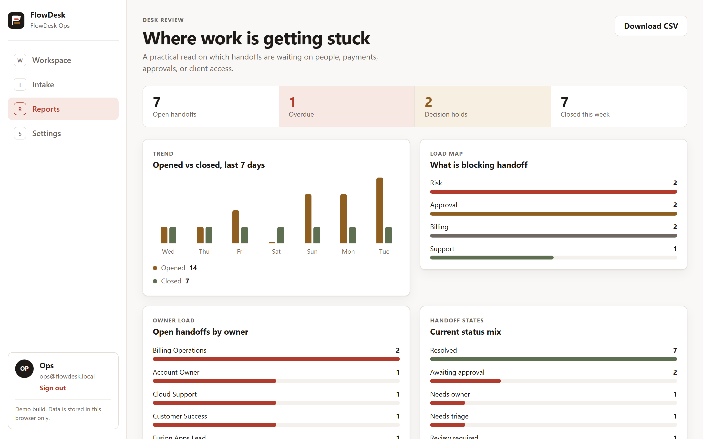
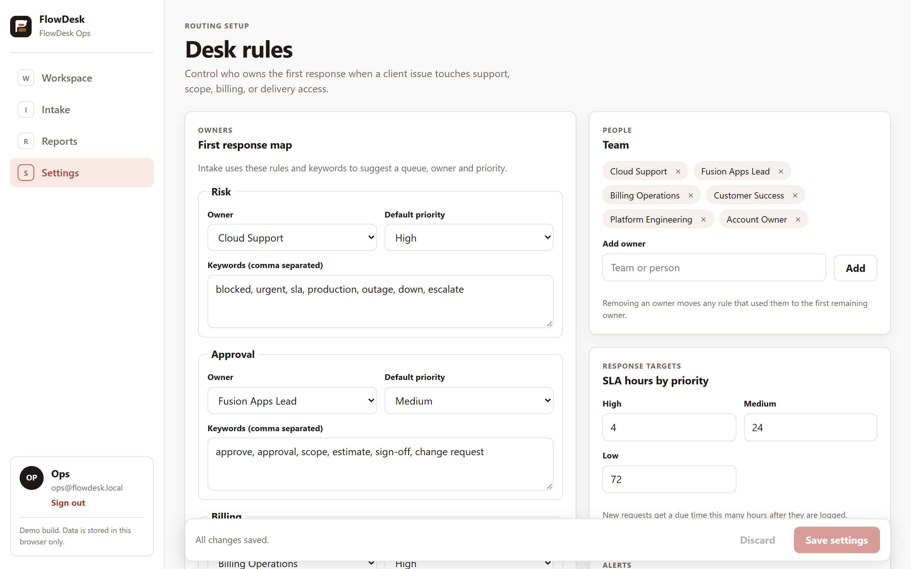
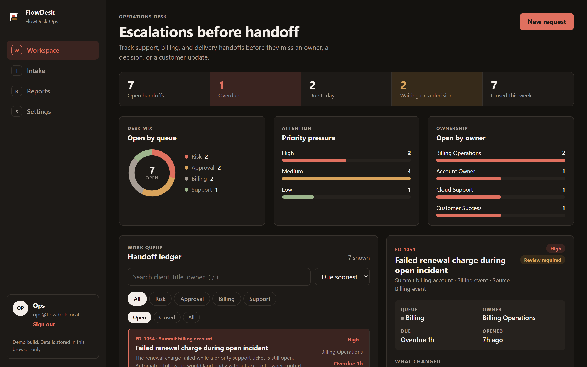
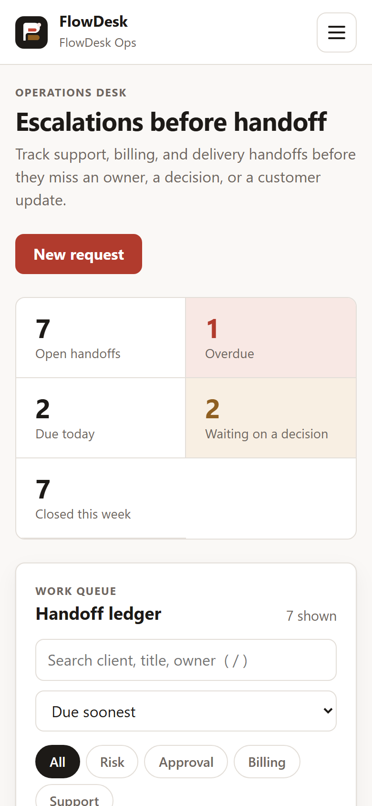
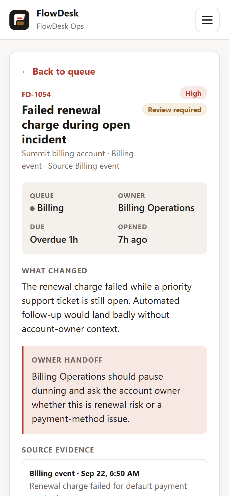

# FlowDesk

**Escalation routing workspace for service operations.** Intake captures a client signal, a rule-based
triage engine routes it to the right queue and owner with an SLA clock, and the decision packet carries
it through to a closed handoff with a note and an audit trail.

Status: **working build**, front-end only. All data is mocked and stored in the browser's `localStorage` —
see [Adding a real backend](#adding-a-real-backend) for what a server integration would replace.



## Contents

- [Screenshots](#screenshots)
- [Run it](#run-it)
- [What it does](#what-it-does)
- [Stack](#stack)
- [Project structure](#project-structure)
- [Testing](#testing)
- [Adding a real backend](#adding-a-real-backend)
- [Deploy](#deploy)
- [Known limits](#known-limits)

## Screenshots

| | |
|---|---|
| **Intake — rule-based routing suggestion** | **Reports — trend and load** |
|  |  |
| **Settings — routing rules drive intake live** | **Dark theme** |
|  |  |
| **Mobile — queue list** | **Mobile — decision packet** |
|  |  |

## Run it

```bash
npm install
npm run dev        # http://localhost:5173
npm run check      # typecheck + tests + production build
npm run build      # outputs dist/
npm run preview    # serve dist/ locally
```

Sign in with any email address and workspace name — there is no password and no account is created.

## What it does

- **Workspace** — a queue of handoffs with real due dates (overdue / due-today counts), search, queue and
  status filters (all state in the URL), sorting, and charts for queue mix, priority pressure and owner load.
- **Decision packet** — assign an owner, change priority (recomputes the SLA due time), add notes, and close
  a handoff (a resolution note is required). Every action lands in an activity trail. Reopen is one click.
- **Intake** — as you type, a rule-based engine suggests a queue, owner and priority with the matched
  keywords shown, using whatever rules are configured in Settings.
- **Reports** — 7-day opened-vs-closed trend, load by queue, owner load, status mix, recent activity, and a
  CSV export that neutralises spreadsheet formula injection (`=`, `+`, `-`, `@` prefixes).
- **Settings** — owners, priorities, keywords and SLA hours per queue, team management, notification toggles
  (stored, not wired to anything), a light/dark/system theme, and a demo-data reset.

Deep links work while signed out (`/workspace/FD-1047` redirects to login and returns you to it after
sign-in), and there's a 404 page and an error boundary with a "clear saved data" recovery path for corrupted
`localStorage`.

## Stack

React 19, TypeScript (strict), React Router, Vite. Vitest + React Testing Library for tests. Hand-written
CSS with light/dark theming via CSS variables — no UI kit, no chart library.

## Project structure

```
src/
  domain/       Pure logic and types: triage rules, request transitions, metrics, CSV, seed data, validation
  api/          client.ts — the mock backend (localStorage + simulated latency)
  state/        AppProvider (session, requests, settings, mutations) and toast notifications
  pages/        Login, Workspace, Intake, Reports, Settings, NotFound
  components/   Shell (nav + auth gate), DecisionPacket, ErrorBoundary, shared UI pieces
  lib/          formatting, theme handling, small hooks
  styles/       app.css — design tokens, light/dark, responsive layout
  test/         component tests and the Testing Library setup
```

`src/domain/*` has no dependency on React or the DOM, so the routing rules, request transitions and metrics
are unit tested directly.

## Testing

```bash
npm test          # unit + component tests (Vitest)
npm run typecheck # tsc --noEmit, strict mode
npm run build     # production build
```

Beyond the automated suite, this build was exercised end-to-end in a real browser: full sign-in → intake →
workspace → reports → settings flows, 30+ combinations of corrupted `localStorage`, keyboard navigation,
mobile viewports, and an axe accessibility scan of every page in both light and dark — with zero console
errors and zero accessibility violations found.

## Adding a real backend

`src/api/client.ts` is the only file that knows data lives in `localStorage`. Every function is async and
returns the same shapes the UI already consumes, so a backend means replacing its bodies with HTTP calls:

| Mock call | Suggested endpoint |
| --- | --- |
| `getSession` / `signIn` / `signOut` | `GET /session`, `POST /session`, `DELETE /session` |
| `listRequests` / `createRequest` | `GET /requests`, `POST /requests` |
| `assignOwner`, `changePriority`, `addNote`, `resolve`, `reopen` | `PATCH /requests/:id` or one action route each |
| `getSettings` / `saveSettings` | `GET /settings`, `PUT /settings` |

`src/domain/transitions.ts` and `triage.ts` hold the business rules today. When a server takes over, move
them there and keep `triage` client-side for the live suggestion on the Intake page. Authentication is also
mocked — replace `signIn` with a real flow before this ever holds customer data.

## Deploy

`firebase.json` serves `dist/` as a single-page app with a strict Content-Security-Policy, HSTS, no-index
headers, and long-lived caching for hashed assets:

```bash
npm run build
firebase deploy --only hosting
```

Any static host works, as long as it rewrites unknown paths to `/index.html`. The app is marked `noindex`
(meta tag, `robots.txt`, and response header) because it is a demo workspace, not a page meant to be indexed.

## Known limits

- Data lives per browser — clearing site data, or opening it in another browser, starts from the seed data.
- Notification settings are stored but nothing is actually sent; the UI says so.
- Triage is rule-based (keywords + request type), not a language model — deliberately, for predictability.

---

Built by [CyphronTech](https://cyphrontech.com) as a working demo — see the
[case study](https://cyphrontech.com/case-flowdesk).
